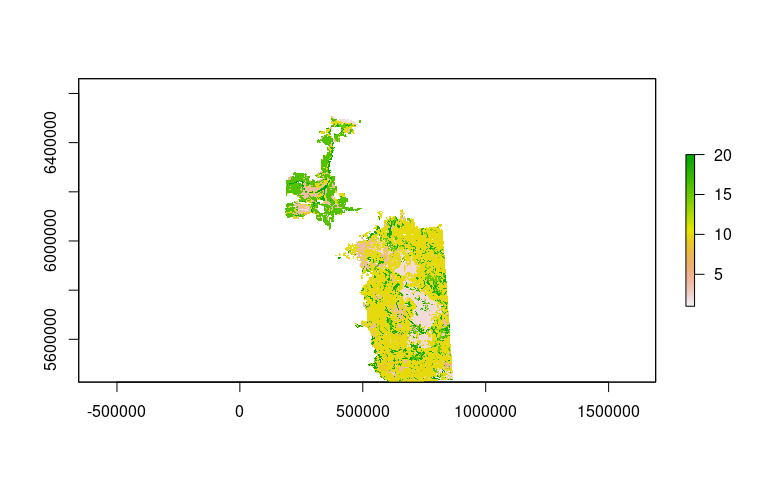
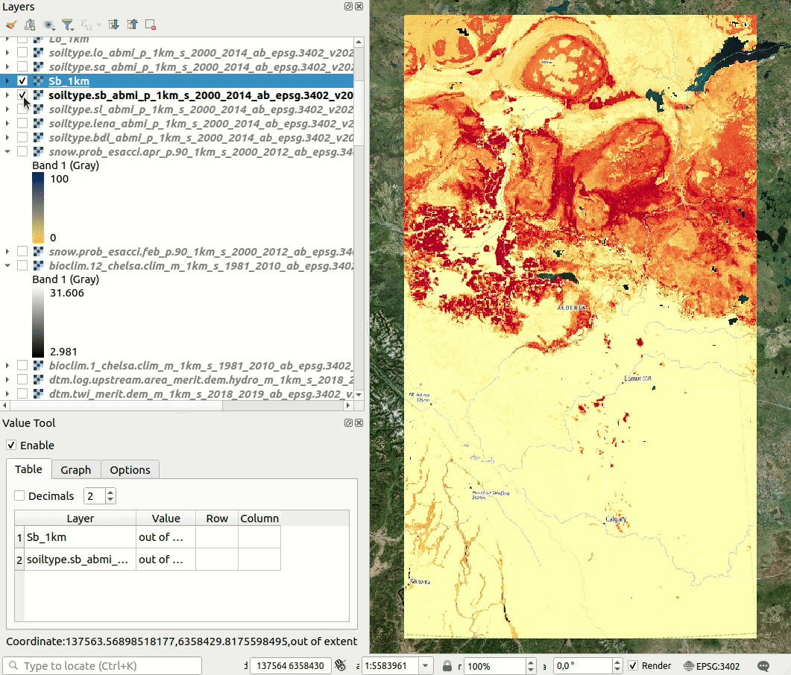

ABMI Soil layers processing
================
Tomislav Hengl (EnvirometriX.nl)
2023-01-27

## ABMI layers

The Agricultural Region of Alberta Soil Inventory Database (AGRASID)
contains various GIS layers that are available publicly via the **[ABMI
project
page](https://abmi.ca/home/data-analytics/da-top/da-product-overview/Other-Geospatial-Land-Surface-Data/ABMI-Soil-Layers.html)**.
The code below shows how to process the ABMI’s soil layer and gap-fill
them so they can be used for spatial modeling. The dataset consists of
two parts:

- a polygon geodatabase with 2 feature classes: vector 1 sq-km grid and
  corresponding centroids. At the Alberta border the cells are not 1
  sq-km.
- a soil summary file.

A common reference column `GRID_LABEL` can be used to join the soil
summary with a feature class.

Note: the gap-filling has been implemented using modeling and hence
comes with potentially significant prediction errors / especially in the
extrapolation areas. **Use at own risk**.

Soil types codes can be accessed from:

``` r
library(knitr)
```

    ## 
    ## Attaching package: 'knitr'

    ## The following object is masked from 'package:terra':
    ## 
    ##     spin

``` r
abmi.leg = read.csv("./abmi_1km/20230119_soil/ABMI_legend.csv")
kable(head(abmi.leg[,c(3,2,1)]), format = "markdown")
```

| ABMI_Code | Description                                                                                                                                                                                                                                        | Site_Type                   |
|:----------|:---------------------------------------------------------------------------------------------------------------------------------------------------------------------------------------------------------------------------------------------------|:----------------------------|
| LenW      | Permanent open standing-water with no emergent vegetation, generally larger than 1.0 ha and \>15 cm deep.                                                                                                                                          | Standing water              |
| LtcR      | Open water of rivers, generally rivers wider than 20 m.                                                                                                                                                                                            | River                       |
| LenT      | Water present \<3 weeks (dry by July) \<15 cm deep.                                                                                                                                                                                                | Temporary                   |
| LenS      | Water usually present \>3 weeks (usually dry by July) \>15 cm deep.                                                                                                                                                                                | Seasonal                    |
| LenA      | Water present \>3 weeks and \>15 cm deep                                                                                                                                                                                                           | Alkali                      |
| LenSP     | Throughout the year except during periods of extreme drought (present in autumn in 70% of the years); often occurs adjacent to LenW; includes the march zones; water is generally \>15 cm deep; if open water is present it is smaller than 1.0 ha | Semi-Permanent to Permanent |

## Rasterizing of polygons

We first need to rasterize polygons (664,767 cells) and convert them to
GeoTIFFs where each GeoTIFF represents one soil types.

``` r
library(rgdal)
library(terra)
library(raster)
library(sf)
library(tidyverse)
```

    ## ── Attaching core tidyverse packages ─────────────────── tidyverse 1.3.2.9000 ──
    ## ✔ dplyr     1.0.0     ✔ readr     1.3.1
    ## ✔ forcats   0.5.0     ✔ stringr   1.4.0
    ## ✔ ggplot2   3.3.2     ✔ tibble    3.0.3
    ## ✔ lubridate 1.7.9     ✔ tidyr     1.1.0
    ## ✔ purrr     0.3.4

    ## ── Conflicts ────────────────────────────────────────── tidyverse_conflicts() ──
    ## ✖ tidyr::extract() masks terra::extract(), raster::extract()
    ## ✖ dplyr::filter()  masks stats::filter()
    ## ✖ dplyr::lag()     masks stats::lag()
    ## ✖ dplyr::select()  masks raster::select()
    ## ℹ Use the ]8;;http://conflicted.r-lib.org/conflicted package]8;; to force all conflicts to become errors

``` r
if(!exists("g1km.r")){
  g1km = sf::read_sf("./abmi_1km/20230119_soil/grid_1sqkm.gpkg")
  g1km.xy = as.data.frame(st_centroid(g1km))
  ## 664,767 cells
  ## read the soil summary table:
  val = vroom::vroom("./abmi_1km/20230119_soil/soil_summary.csv")
  g1km.xy = plyr::join(g1km.xy, val)
  g1km.xy$X = st_coordinates(g1km.xy$geom)[,1]
  g1km.xy$Y = st_coordinates(g1km.xy$geom)[,2]
  ## generate gridded object:
  g1km.r = SpatialPixelsDataFrame(as.matrix(g1km.xy[,c("X","Y")]), 
        data=g1km.xy[,names(val)], proj4string = CRS("EPSG:3400"), tolerance = 0.820279)
}
```

    ## Warning in st_centroid.sf(g1km): st_centroid assumes attributes are constant
    ## over geometries of x

    ## Rows: 664,767
    ## Columns: 25
    ## Delimiter: ","
    ## chr [ 1]: GRID_LABEL
    ## dbl [24]: BdL, BlO, CS, Cy, Gr, LenA, LenS, LenSP, LenT, Li, Lo, LtcC, LtcD, LtcH, LtcS, O...
    ## 
    ## Use `spec()` to retrieve the guessed column specification
    ## Pass a specification to the `col_types` argument to quiet this message

    ## Joining by: GRID_LABEL

    ## Warning in points2grid(points, tolerance, round): grid has empty column/rows in
    ## dimension 1

    ## Warning in points2grid(points, tolerance, round): grid has empty column/rows in
    ## dimension 2

Some ABMI units are relatively rare and probably not suitable for
gap-filling. We focus instead on the following soil types:

``` r
t.l = c("BdL", "BlO", "CS", "Cy", "Gr", "LenA", "LenS", "LenSP", "LenT", "Li", "Lo",
   "LtcC", "LtcD", "LtcH", "LtcS", "Ov", "Sa", "Sb", "SL", "SwG", "Sy", "TB")
```

Next, we need to remove non-soil map and then can write each ABMI unit
as a separate image with values in 0–100%:

``` r
rs = rowSums(g1km.r@data[,t.l])
sel.r = which(!rs == 0)
if(!any(file.exists(paste0("./abmi_1km/", t.l, "_1km.tif")))){
  x = lapply(t.l, function(i){ 
    r <- round(raster::raster(g1km.r[sel.r,i])/1e6*100);
    r = raster::focal(r, w=matrix(1,3,3), fun=mean, na.rm=TRUE, NAonly=TRUE);
    raster::writeRaster(r, paste0("./abmi_1km/", i, "_1km.tif"), datatype='INT1U', NAflag=255, options="COMPRESS=DEFLATE")
    })
}
```

We can next resample the temporary images to some standard grid covering
whole of Alberta:

## Gap filling

Because the AGRASID covers only agricultural region of Alberta, about
30-40% of pixels have missing values. One way to fill-in those gaps is
to use correlation with soil-forming factors and then use the modeling
results to predict all missing pixels. We can attach number of covariate
layers representing relief (elevation, slope, TWI), climate (e.g. snow
probability, [CHELSA Bioclimatic
variables](https://chelsa-climate.org/bioclim/)), [cropland
intensity](https://doi.org/10.5194/essd-13-5403-2021), long-term annual
EVI based on MOD13Q1 product. We can load all layers:

``` r
if(!exists("f1km")){
  f1km = raster::stack(c(paste0('./tmp/', t.l, '_1km.tif'), 
        "./grids1km/2020/lcv.cropland_bowen.et.al_m_1km_s_20200101_20201231_ab_epsg.3402_v20221130.tif",
        paste0("./grids1km/static/", c(
        #"wetland.grade_abmi_m_1km_s_2000_2014_ab_epsg.3402_v20230120.tif",
        "dtm.slope_geomorphon90m_m_1km_s_2018_2019_ab_epsg.3402_v20221201.tif",
        "dtm.twi_merit.dem_m_1km_s_2018_2019_ab_epsg.3402_v20221201.tif",
        "dtm.elev_glo90_m_1km_s_2019_2020_ab_epsg.3402_v20221201.tif",
        "bioclim.1_chelsa.clim_m_1km_s_1981_2010_ab_epsg.3402_v20221201.tif",
        "bioclim.12_chelsa.clim_m_1km_s_1981_2010_ab_epsg.3402_v20221201.tif",
        "snow.prob_esacci.apr_p.90_1km_s_2000_2012_ab_epsg.3402_v20221201.tif",
        "annual.evi_mod13q1.v061_p50_1km_s_20150101_20211231_ab_epsg.3402_v20221201.tif",
        "annual.evi_mod13q1.v061_p95_1km_s_20150101_20211231_ab_epsg.3402_v20221201.tif"))))
  f1km = as(f1km, "SpatialGridDataFrame")
}
sel.m = rowSums(f1km@data[,paste0(t.l, "_1km")]) > 0
## 262,370
```

Next we need to derive the most probable class per pixel that we can
then use for model training:

``` r
maxm <- sapply(data.frame(t(as.matrix(f1km@data[which(sel.m),paste0(t.l, "_1km")]))), 
               FUN=function(x){max(x, na.rm=TRUE)})
## class having the highest membership
cout <- rep(NA, length(which(sel.m)))
for(c in t.l){
  cout[which(f1km@data[which(sel.m),paste0(c, "_1km")] == maxm)] <- c
}
f1km$soil = NA
f1km@data[which(sel.m),"soil"] <- cout
f1km$soil = as.factor(f1km$soil)
summary(f1km$soil)
```

    ##    BdL    BlO     CS     Cy     Gr   LenA   LenS  LenSP     Li     Lo   LtcC 
    ##    212  27231    606  19237   1218    308     25    416   3030 146370     48 
    ##   LtcD   LtcH     Ov     Sa     Sb     SL    SwG     Sy     TB   NA's 
    ##     65      1   1363  10827  26687     78   1124  16821   6703 596494

This produce the following map:

``` r
plot(raster(f1km["soil"]))
```



Now that we have prepared target variable (ABMI units) and all
covariates, we can fit a random forest model to try to explain
distribution of soil types using soil-forming factors (climate, relief,
vegetation etc). For this we use the ranger package:

``` r
library(ranger)
fm.n = names(f1km)[grep("epsg.3402", names(f1km))]
fm.soil = as.formula(paste(" soil ~ ", paste(fm.n, collapse = "+")))
sel = complete.cases(f1km@data[,all.vars(fm.soil)]) & sel.m
if(!exists("m.soil")){
  m.soil = ranger::ranger(fm.soil, data=f1km@data[sel,], mtry=5, 
                    num.trees=150, importance="impurity", probability = TRUE)
  m.soil
}
```

    ## Ranger result
    ## 
    ## Call:
    ##  ranger::ranger(fm.soil, data = f1km@data[sel, ], mtry = 5, num.trees = 150,      importance = "impurity", probability = TRUE) 
    ## 
    ## Type:                             Probability estimation 
    ## Number of trees:                  150 
    ## Sample size:                      262117 
    ## Number of independent variables:  7 
    ## Mtry:                             5 
    ## Target node size:                 10 
    ## Variable importance mode:         impurity 
    ## Splitrule:                        gini 
    ## OOB prediction error (Brier s.):  0.1229703

The model seems to be relatively accurate with OOB error of about 0.12.
This means that the model can be indeed used to gap fill missing pixels.

Variable importance shows that the most important variable is elevation:

``` r
varImp = data.frame(m.soil$variable.importance)
varImp
```

    ##                                                                           m.soil.variable.importance
    ## lcv.cropland_bowen.et.al_m_1km_s_20200101_20201231_ab_epsg.3402_v20221130                   16598.77
    ## dtm.slope_geomorphon90m_m_1km_s_2018_2019_ab_epsg.3402_v20221201                            21026.17
    ## dtm.twi_merit.dem_m_1km_s_2018_2019_ab_epsg.3402_v20221201                                  10016.31
    ## dtm.elev_glo90_m_1km_s_2019_2020_ab_epsg.3402_v20221201                                     32579.44
    ## bioclim.1_chelsa.clim_m_1km_s_1981_2010_ab_epsg.3402_v20221201                              23377.15
    ## bioclim.12_chelsa.clim_m_1km_s_1981_2010_ab_epsg.3402_v20221201                             26896.12
    ## snow.prob_esacci.apr_p.90_1km_s_2000_2012_ab_epsg.3402_v20221201                            18794.70

## Final maps

Now that we have fitted a model to gap-fill missing values, we can bind
the existing and predicted values per soil type. We run this per ABMI
unit and then save the ouput as a probability / fraction image with
values 0-100%:

``` r
new.r = which(is.na(sel.m) & complete.cases(f1km@data[,fm.n]))
pred.soil = predict(m.soil, data = f1km@data[new.r, m.soil$forest$independent.variable.names])
#str(pred.soil)
## write final rasters:
t.i = c("BdL", "BlO", "CS", "Cy", "Gr", "LenA", "LenSP", "Li", "Lo", "LtcC", "LtcD", "Ov", "Sa", "Sb", "SL", "SwG", "Sy", "TB")
for(c in t.i){
  out.tif = paste0("./grids1km/static/soiltype.", tolower(c), "_abmi_p_1km_s_2000_2014_ab_epsg.3402_v20230120.tif")
  f1km$out = NULL
  f1km@data[,"out"] = f1km@data[,paste0(c, "_1km")]
  f1km@data[new.r,"out"] = round(100*pred.soil$predictions[,which(c == attr(m.soil$predictions, "dimnames")[[2]])])
  rgdal::writeGDAL(f1km["out"], out.tif, drivername = "GTiff", type="Byte", mvFlag=255, options=c("-co COMPRESS=LZW"))
}
```

The whole process can be summarize with the following animation:



Have in mind that the predicted ABMI units might be of poor accuracy,
especially in mountain areas and similar that are significantly
different than the training data. In summary: the gap-filled maps should
be used for testing purposes only. If you discover a bug or have an idea
how to advance the analysis, please commit a code + a merge request.

## Acknowledgments

This work has been implemented within the **Alberta Background Soil
Quality System** lead by [Innotech
Alberta](https://innotechalberta.ca/).
